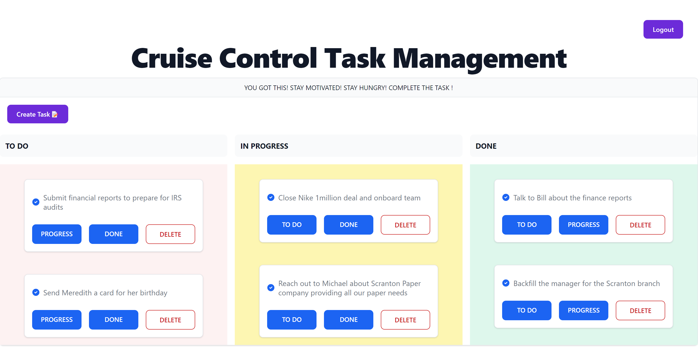

# WELCOME TO Cruise Control Task Manager

This is a shared task management tool thats used to help you keep track of the things you need to do, are working on and have finished 


## Tech Stack

**Client:** EJS, Javascript, Flowbite, TailwindCSS, HTML/CSS
**Server:** Node, Express, Passport, Mongoose, MongoDB


## Features

- User login and authentication
- Contribute to shared task board by selecting "Create Task"
- Move the task around my selecting the "TO DO" , "PROGRESS" , "DONE" button. Select "DELETE" to remove the task from your board.


## Screenshots




## Run Locally

Clone the project

```bash
  git clone https://github.com/socratic617/task-management-tool.git
```

Go to the project directory

```bash
  cd task-management-tool
```

Install dependencies

```bash
  npm install
```

Start the server

```bash
  npm start
```


## Lessons Learned

I learned how to filter the tasks into different columns. I learned how to more easily reference the id of the task from MongoDB through the parent element instead of hardcoding it to all of the buttons.